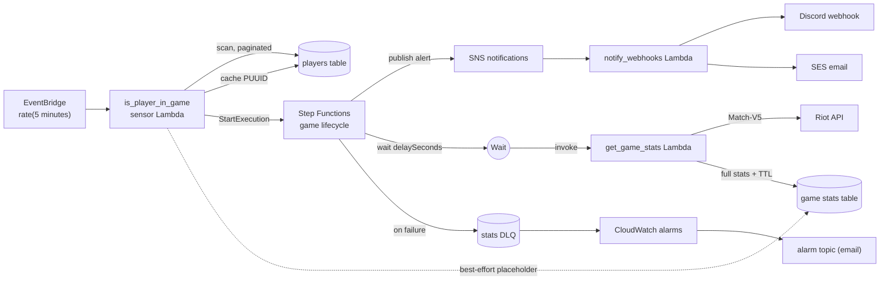
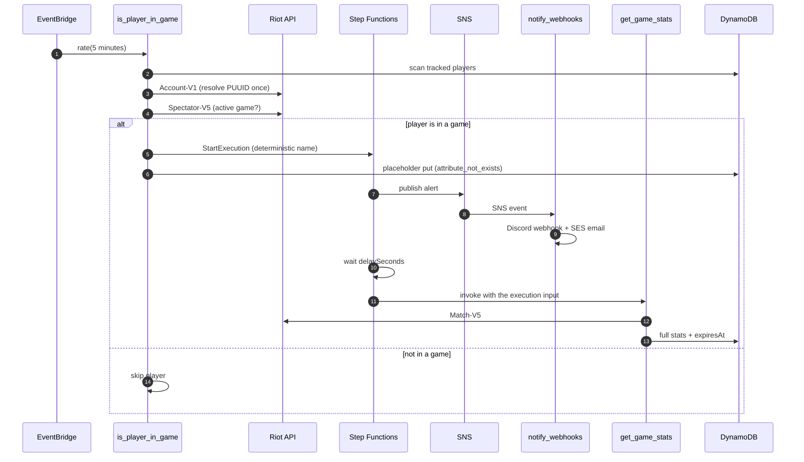

# In Game Now Notifications

[](https://github.com/javierGuerraDevelop/in-game-now-notifications/actions/workflows/ci.yml)


**In Game Now Notifications** watches a small, user-managed list of League of Legends
players and pings a Discord channel and/or an email inbox the moment one of them enters
a game. After a configurable delay it fetches the finished match and archives the
player's performance in DynamoDB. It is built entirely on AWS serverless services —
Lambda, Step Functions, SNS, SQS, DynamoDB, and Secrets Manager — provisioned with AWS
SAM and shipped by a GitHub Actions pipeline.

## How it works

1. **Detect** — an EventBridge schedule runs the `is_player_in_game` sensor every
   5 minutes. It paginates the players table, resolves and caches each player's Riot
   PUUID through Account-V1, and checks Spectator-V5 for an active game.
2. **Alert** — on detection the sensor starts exactly one Step Functions execution per
   game (the deterministic name `game-<matchId>-<puuid[:8]>` makes duplicate detection
   a no-op) and writes a best-effort placeholder record. The state machine publishes
   the alert to SNS, which fans out to a Discord webhook and an SES email through the
   `notify_webhooks` Lambda.
3. **Collect** — the execution waits `GAME_STATS_DELAY_SECONDS` (default one hour),
   then invokes `get_game_stats`. That Lambda fetches the match from Match-V5 and
   overwrites the placeholder with the full stat line; "match not ready yet" 404s are
   retried with exponential backoff.
4. **Fail safely** — a failure that survives the retries is sent to the stats
   dead-letter queue and fails the execution, which raises a CloudWatch alarm.
5. **Expire** — DynamoDB TTL deletes game records after `STATS_TTL_DAYS` (default 30).

## Architecture

### Components



### Alert to stats sequence



## Repository layout

```text
.
├── template.yaml             # all AWS resources: Lambdas, DynamoDB, SNS, SQS, Step Functions, IAM, alarms
├── samconfig.toml            # deploy defaults
├── Makefile                  # fmt / lint / test / build / validate / clean
├── pyproject.toml            # ruff + pytest configuration
├── requirements-dev.txt      # dev-only tooling: pytest, pytest-cov, ruff, boto3
├── src/
│   ├── common.py             # JSON logging, config parsing, Riot HTTP client, secret resolution
│   ├── is_player_in_game.py  # sensor Lambda
│   ├── get_game_stats.py     # stats collector Lambda
│   └── notify_webhooks.py    # notifier Lambda
├── tests/                    # pytest suite, one module per handler
├── events/                   # sample events for `sam local invoke`
└── .github/workflows/ci.yml  # lint, test, template, deploy
```

## Getting started

Prerequisites:

- Python 3.13 (for local development and tests)
- [AWS SAM CLI](https://docs.aws.amazon.com/serverless-application-model/latest/developerguide/install-sam-cli.html)
- AWS credentials that can create CloudFormation stacks and IAM roles
- A Riot API key from [developer.riotgames.com](https://developer.riotgames.com/)

### Configuration parameters

| Parameter | Required | Default | Purpose |
|---|---|---|---|
| `RiotApiKeySecretArn` | yes | — | ARN of the Secrets Manager secret that holds the Riot API key |
| `SesSenderEmail` | yes | — | Verified SES sender identity |
| `RecipientEmail` | yes | — | Email that receives game notifications and alarms |
| `DiscordWebhookUrl` | no | `""` | Discord webhook; Discord notifications are skipped when empty |
| `MatchRegion` | no | `americas` | Regional route for Account-V1 and Match-V5 (`americas`, `europe`, `asia`) |
| `RiotRegion` | no | `na1` | Platform region for Spectator-V5 (`na1`, `euw1`, `kr`, ...) |

### Riot API key secret

The stack takes only the ARN of a Secrets Manager secret; never put the key itself in
the template or in `samconfig.toml`.

Create the secret before deploying:

```bash
aws secretsmanager create-secret --name in-game-now-notifications/riot-api-key \
  --secret-string "$RIOT_API_KEY"
```

Riot development keys expire every 24 hours. Rotate the secret value without
redeploying anything:

```bash
aws secretsmanager put-secret-value --secret-id in-game-now-notifications/riot-api-key \
  --secret-string "$RIOT_API_KEY"
```

For local development, the `RIOT_API_KEY` environment variable takes precedence over
Secrets Manager.

### Deploy

```bash
sam build
sam deploy --guided
```

`sam deploy --guided` prompts for the parameters above and saves them to
`samconfig.toml`, so later deployments are just `sam deploy`. After the first deploy,
confirm the alarm email subscription from the alarms topic once.

### Seed tracked players

Players are managed directly in DynamoDB. Add one with:

```bash
aws dynamodb put-item --table-name in-game-now-players \
  --item '{"playerId":{"S":"Name#TAG"},"gameName":{"S":"Name"},"tagLine":{"S":"TAG"}}'
```

The sensor picks the player up on its next run and caches the resolved PUUID on the
item after the first successful lookup.

### Local development

```bash
python3.13 -m venv .venv
source .venv/bin/activate
pip install -r requirements-dev.txt

make lint      # ruff check + ruff format --check
make test      # pytest
make validate  # sam validate --lint
make build     # sam build
```

Run a function locally with one of the sample events (Docker required):

```bash
sam local invoke GetGameStatsFunction --event events/get_game_stats.json
sam local invoke NotifyWebhooksFunction --event events/notify_webhooks.json
sam local invoke IsPlayerInGameFunction --event events/is_player_in_game.json
```

Set `RIOT_API_KEY` (the local fallback), the table names, and the region variables in
an `env.json` file for local invocations.

## Operations

### Alarms

All alarms publish to the alarms topic and email `RecipientEmail`. They use
`TreatMissingData: notBreaching`, so they only fire on real activity:

| Alarm | Metric | Fires when |
|---|---|---|
| `DetectionLambdaErrorsAlarm` | `AWS/Lambda` `Errors` for the sensor | any error in a 5-minute period |
| `DetectionDLQAlarm` | `AWS/SQS` `ApproximateNumberOfMessagesVisible` for the detection DLQ | any visible message in a 5-minute period |
| `StatsDLQAlarm` | `AWS/SQS` `ApproximateNumberOfMessagesVisible` for the stats DLQ | any visible message in a 5-minute period |
| `StateMachineFailuresAlarm` | `AWS/States` `ExecutionsFailed` | any failed execution in a 5-minute period |

### Inspecting dead-letter queues

Messages in a dead-letter queue carry the full invocation or execution payload, so you
can replay them after fixing the cause:

```bash
aws sqs get-queue-url --queue-name in-game-now-stats-dlq
aws sqs receive-message --queue-url <queue-url> --max-number-of-messages 10
```

The detection DLQ holds asynchronous sensor invocations that failed; the stats DLQ
holds game payloads whose stats collection failed after all retries.

### Rotating the Riot API key

Riot development keys expire every 24 hours, and production keys can be rotated on
demand. Update the secret value — no redeploy is needed:

```bash
aws secretsmanager put-secret-value --secret-id in-game-now-notifications/riot-api-key \
  --secret-string "$RIOT_API_KEY"
```

Functions read the secret at startup, so the next cold start picks up the new value.

### Record expiry

Both the placeholder and the full stats record carry `expiresAt`, and the game stats
table has DynamoDB TTL enabled on it. DynamoDB deletes expired items automatically,
typically within 48 hours after expiry. Tune the retention with the `STATS_TTL_DAYS`
value in `template.yaml` (default 30 days).

### Cost notes

For a handful of tracked players the workload stays within the AWS free tier:

- **Lambda** — one short invocation every 5 minutes, plus a few per detected game.
- **Step Functions** (Standard) — one execution per detected game; waits are free and
  only state transitions are billed.
- **DynamoDB** — on-demand billing for tiny items; TTL deletes are free.
- **SNS, SQS, SES** — negligible traffic at this scale.
- **CloudWatch and X-Ray** — alarms and traces are the main variable cost; lower the
  X-Ray sampling rate or the log retention if you want to be strict about it.

## Troubleshooting

| Symptom | Likely cause | What to do |
|---|---|---|
| Account lookups return `403` and read "API key may be expired" | A Riot development key is only valid for 24 hours | Rotate the secret value with `put-secret-value`; no redeploy needed |
| Logs show `RateLimitedError` / `429` responses | Riot rate limits were hit | The sensor runs every 5 minutes on its own; wait for the next run or use a key with higher limits |
| Stats collection repeatedly logs `404` for a match | Match-V5 has not finished processing the game yet | Expected: the state machine retries with exponential backoff, and only gives up into the stats DLQ after eight attempts |
| Logs say "game already tracked" | The same game was detected again | Expected: execution names are deterministic, so duplicates are no-ops and never send a second notification |
| Deploy job fails on `main` | The GitHub OIDC role or repository secrets are missing | Follow the CI/CD setup section below |

## CI/CD and deployment

`.github/workflows/ci.yml` runs ruff and pytest on every push and pull request,
validates and builds the SAM template, and deploys to AWS on pushes to `main`.

The deploy job assumes an IAM role through GitHub OIDC. Required repository secrets:

| Secret | Purpose |
|---|---|
| `AWS_ROLE_ARN` | IAM role assumed by the deploy job |
| `RIOT_API_KEY_SECRET_ARN` | Secrets Manager ARN that holds the Riot API key |
| `SES_SENDER_EMAIL` | Verified SES sender identity |
| `RECIPIENT_EMAIL` | Notification and alarm recipient |
| `DISCORD_WEBHOOK_URL` | Discord webhook for alerts |

One-time AWS setup:

1. Create a GitHub OIDC identity provider for
   `https://token.actions.githubusercontent.com` with audience `sts.amazonaws.com`.
2. Create an IAM role trusted by that provider, scoped to this repository and ideally
   to refs under `refs/heads/main`, with permission to deploy the stack (CloudFormation,
   S3, IAM, Lambda, DynamoDB, SNS, SQS, Step Functions, EventBridge, CloudWatch, and
   X-Ray).
3. Store the role ARN as the `AWS_ROLE_ARN` repository secret.

After the first deploy, confirm the alarm email subscription from the alarms topic once.
