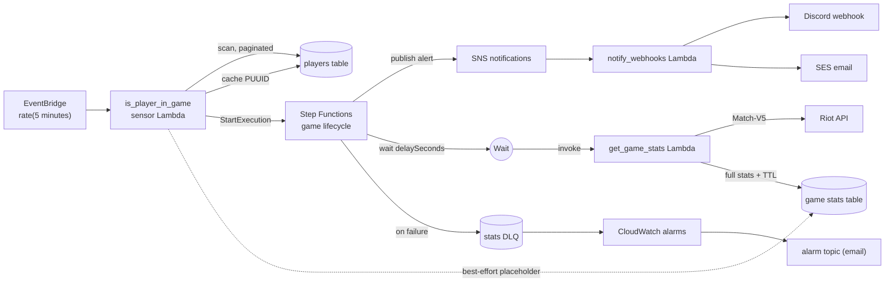
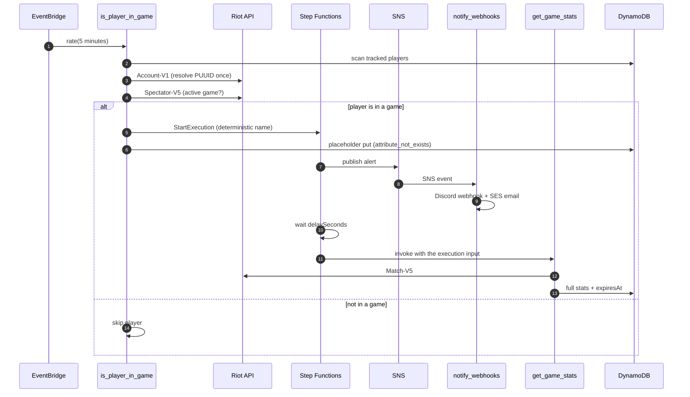

# In Game Now Notifications

[](https://github.com/javierGuerraDevelop/in-game-now-notifications/actions/workflows/ci.yml)


**In Game Now Notifications** watches a small, user-managed list of League of Legends
players and pings a Discord channel and/or an email inbox the moment one of them enters
a game. After a configurable delay it fetches the finished match and archives the
player's performance in DynamoDB. It is built entirely on AWS serverless services —
Lambda, Step Functions, SNS, SQS, DynamoDB, and Secrets Manager — provisioned with AWS
SAM and shipped by a GitHub Actions pipeline.

## How it works

1. **Detect** — an EventBridge schedule runs the `is_player_in_game` sensor every
   5 minutes. It paginates the players table, resolves and caches each player's Riot
   PUUID through Account-V1, and checks Spectator-V5 for an active game.
2. **Alert** — on detection the sensor starts exactly one Step Functions execution per
   game (the deterministic name `game-<matchId>-<puuid[:8]>` makes duplicate detection
   a no-op) and writes a best-effort placeholder record. The state machine publishes
   the alert to SNS, which fans out to a Discord webhook and an SES email through the
   `notify_webhooks` Lambda.
3. **Collect** — the execution waits `GAME_STATS_DELAY_SECONDS` (default one hour),
   then invokes `get_game_stats`. That Lambda fetches the match from Match-V5 and
   overwrites the placeholder with the full stat line; "match not ready yet" 404s are
   retried with exponential backoff.
4. **Fail safely** — a failure that survives the retries is sent to the stats
   dead-letter queue and fails the execution, which raises a CloudWatch alarm.
5. **Expire** — DynamoDB TTL deletes game records after `STATS_TTL_DAYS` (default 30).

## Architecture

### Components



### Alert to stats sequence



## Repository layout

```text
.
├── template.yaml             # all AWS resources: Lambdas, DynamoDB, SNS, SQS, Step Functions, IAM, alarms
├── samconfig.toml            # deploy defaults
├── Makefile                  # fmt / lint / test / build / validate / clean
├── pyproject.toml            # ruff + pytest configuration
├── requirements-dev.txt      # dev-only tooling: pytest, pytest-cov, ruff, boto3
├── src/
│   ├── common.py             # JSON logging, config parsing, Riot HTTP client, secret resolution
│   ├── is_player_in_game.py  # sensor Lambda
│   ├── get_game_stats.py     # stats collector Lambda
│   └── notify_webhooks.py    # notifier Lambda
├── tests/                    # pytest suite, one module per handler
├── events/                   # sample events for `sam local invoke`
└── .github/workflows/ci.yml  # lint, test, template, deploy
```

## Riot API key

The stack takes only the ARN of a Secrets Manager secret; never put the key itself in
the template or in `samconfig.toml`.

Create the secret before deploying:

```bash
aws secretsmanager create-secret --name in-game-now-notifications/riot-api-key \
  --secret-string "$RIOT_API_KEY"
```

Riot development keys expire every 24 hours. Rotate the secret value without
redeploying anything:

```bash
aws secretsmanager put-secret-value --secret-id in-game-now-notifications/riot-api-key \
  --secret-string "$RIOT_API_KEY"
```

For local development, the `RIOT_API_KEY` environment variable takes precedence over
Secrets Manager.

## CI/CD and deployment

`.github/workflows/ci.yml` runs ruff and pytest on every push and pull request,
validates and builds the SAM template, and deploys to AWS on pushes to `main`.

The deploy job assumes an IAM role through GitHub OIDC. Required repository secrets:

| Secret | Purpose |
|---|---|
| `AWS_ROLE_ARN` | IAM role assumed by the deploy job |
| `RIOT_API_KEY_SECRET_ARN` | Secrets Manager ARN that holds the Riot API key |
| `SES_SENDER_EMAIL` | Verified SES sender identity |
| `RECIPIENT_EMAIL` | Notification and alarm recipient |
| `DISCORD_WEBHOOK_URL` | Discord webhook for alerts |

One-time AWS setup:

1. Create a GitHub OIDC identity provider for
   `https://token.actions.githubusercontent.com` with audience `sts.amazonaws.com`.
2. Create an IAM role trusted by that provider, scoped to this repository and ideally
   to refs under `refs/heads/main`, with permission to deploy the stack (CloudFormation,
   S3, IAM, Lambda, DynamoDB, SNS, SQS, Step Functions, EventBridge, CloudWatch, and
   X-Ray).
3. Store the role ARN as the `AWS_ROLE_ARN` repository secret.

After the first deploy, confirm the alarm email subscription from the alarms topic once.
